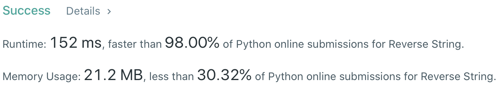
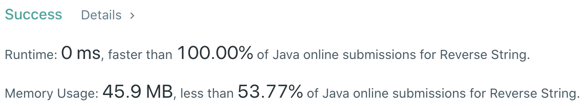

# Problem
[344. Reverse String](https://leetcode.com/problems/reverse-string/)

# Performance



# Python
```Python
class Solution(object):
    def reverseString(self, s):
        """
        :type s: List[str]
        :rtype: None Do not return anything, modify s in-place instead.
        """
        
        # (base case)
        if len(s) == 1: return s

        # ==================================================
        #  String                                          =
        # ==================================================
        # time  : O(n)
        # space : O(1)
        
        left, right = 0, len(s) - 1
        while left < right:
            s[left], s[right] = s[right], s[left]
            left, right = left + 1, right - 1
```

# Java
```Java
class Solution {
    /**
     * @time  : O(n)
     * @space : O(1)
     */
    
    public void reverseString(char[] s) {
        /* base case */
        if(s.length == 1) return;
        
        int l = 0, r = s.length - 1;
        while(l <= r) {
            char tmp = s[l];
            s[l] = s[r];
            s[r] = tmp;
                
            l++;
            r--;
        }
    }
}
```