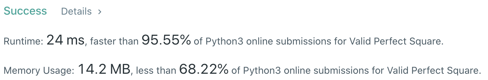
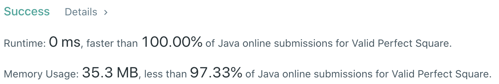

# Problem
[367. Valid Perfect Square](https://leetcode.com/problems/valid-perfect-square/)

# Performance



# Python
```Python
class Solution:
    def isPerfectSquare(self, num: int) -> bool:
        # (base case)
        if num == 1: return 1
        
        # ==================================================
        #  Array + Binary Search                           =
        # ==================================================
        # time  : O(log(n))
        # space : O(1)
        
        l, r = 0, num
        while l < r:
            mid = (l + r) // 2
            val = mid * mid
            
            if val == num: return True
            elif val > num: r = mid
            elif val < num: l = mid + 1
            
        return False
```

# Java
```Java
class Solution {
    /**
     * @time  : O(log(n))
     * @space : O(1)
     */
    
    public boolean isPerfectSquare(int num) {
        /* base case */
        if(num == 1) return true;
        
        int l = 1, r = num;
        while(l < r) {
            int mid = l + (r - l) / 2;
            long val = (long) mid * mid;
            
            if(val == num) return true;
            else if(val > num) r = mid;
            else if(val < num) l = mid + 1;
        }
        
        return false;
    }
}
```