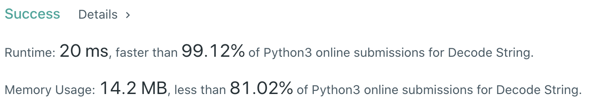

# Problem
[394. Decode String](https://leetcode.com/problems/decode-string/)

# Performance


# Python
```Python
class Solution:
    def decodeString(self, s: str) -> str:
        
        # ==================================================
        #  String + Stack                                  =
        # ==================================================
        # time  : O(n)
        # space : O(m), m is the number of pairs of square brackets
        
        ans, stack, curNum = '', [], 0
        
        for char in s:
            if char.isdigit():
                curNum = curNum * 10 + int(char)
                
            elif char == '[':
                stack.append((ans, curNum))
                ans, curNum = '', 0
                
            elif char == ']':
                prev, num = stack.pop()
                ans = prev + num * ans
                
            else:
                ans += char
        
        return ans
```

# Java
```Java
class Solution {
    /**
     * @time  : O(n)
     * @space : O(m), m is the number of pairs of square brackets
     */
    
    public String decodeString(String s) {
        int curNum = 0;
        String ans = "";
        Stack<Integer> numStack = new Stack<>();
        Stack<String> strStack = new Stack<>();
        
        for(int i=0 ; i<s.length() ; i++) {
            char c = s.charAt(i);
            
            if(Character.isDigit(c)) {
                curNum = curNum * 10 + (c - '0');
                
            } else if(c == '[') {
                numStack.push(curNum);
                strStack.push(ans);
                curNum = 0;
                ans = "";
                
            } else if(c == ']') {
                String prev = strStack.pop();
                int num = numStack.pop();
                ans = prev + ans.repeat(num);
                
            } else {
                ans += c;
            }
        }
        
        return ans;
    }
}
```