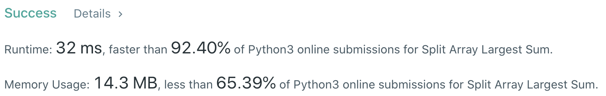
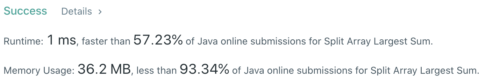

# Problem
[410. Split Array Largest Sum](https://leetcode.com/problems/split-array-largest-sum/)

# Performance



# Python
```Python
class Solution:
    def splitArray(self, nums: List[int], m: int) -> int:
        
        # ==================================================
        #  Binary Search                                   =
        # ==================================================
        # time  : O(nlog(m)), m is the search space
        # space : O(1)
        
        l, r = max(nums), sum(nums)
        
        while l < r:
            mid = (l + r) // 2
            
            count, groups = 0, 1
            for num in nums:
                count += num
                if count > mid:
                    count = num
                    groups += 1
                    
                if groups > m: break
                    
            if groups <= m: r = mid
            else: l = mid + 1
            
        return l
```

# Java
```Java
class Solution {
    /**
     * @time  : O(nlog(m)), m is the search space
     * @space : O(1)
     */
    
    public int splitArray(int[] nums, int m) {
        int l = 0, r = 0;
        for (int n: nums) {
            l = Math.max(l, n);
            r += n;
        }
        
        while(l < r) {
            int mid = (l + r) / 2;
            
            int count = 0, groups = 1;
            for(int n: nums) {
                count += n;
                if(count > mid) {
                    count = n;
                    groups += 1;
                }
                
                if(groups > m) break;
            }
            
            if(groups <= m) r = mid;
            else l = mid + 1;
        }
        
        return l;
    }
}
```