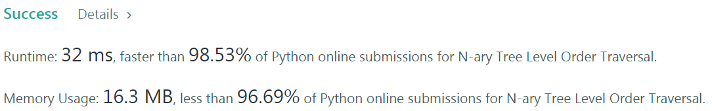
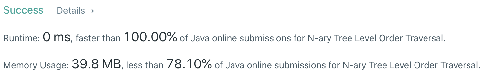

# Problem
[429. N-ary Tree Level Order Traversal](https://leetcode.com/problems/n-ary-tree-level-order-traversal/)

# Performance



# Python
```python
class Solution:
    def levelOrder(self, root: 'Node') -> List[List[int]]:
        # (base case)
        if not root: return []
        if not root.children: return [[root.val]]
        
        # ==================================================
        #  N-ary Tree + Level Order Traversal (Iterative)  =
        # ==================================================
        # time  : O(n)
        # space : O(n)
        
        ans = []
        stack = [root]
        
        while stack:
            tmp = []
            for i in range(len(stack)):
                node = stack.pop(0)
                tmp.append(node.val)
                
                for element in node.children: stack.append(element)
                    
            ans.append(tmp)
                    
        return ans
```

```python
class Solution:
    def levelOrder(self, root: 'Node') -> List[List[int]]:
        # (base case)
        if not root: return []
        if not root.children: return [[root.val]]
        
        # ==================================================
        #  N-ary Tree + Level Order Traversal (Recursive)  =
        # ==================================================
        # time  : O(n)
        # space : O(n)
        
        ans = []
        
        def recursive(node: 'Node', level: int) -> None:
            if len(ans) == level: ans.append([])
                
            ans[level].append(node.val)
            
            if node.children:
                for element in node.children:
                    recursive(element, level + 1)
        
        recursive(root, 0)
        return ans
```

# Java
```Java
class Solution {
    /**
     * @time  : O(n)
     * @space : O(n)
     */
    
    List<List<Integer>> ans = new ArrayList<>();
    
    public List<List<Integer>> levelOrder(Node root) {
        /* base case */
        if(root == null) return ans;
        
        recursive(root, 0);
        return ans;
    }
    
    public void recursive(Node root, int level) {
        if(ans.size() == level) {
            ans.add(new ArrayList<>());
        }
        
        ans.get(level).add(root.val);
        
        for(Node node: root.children) {
            recursive(node, level + 1);
        }
    }
}
```