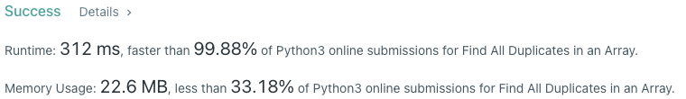
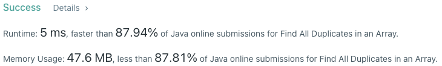

# Problem
[217. Contains Duplicate](https://leetcode.com/problems/contains-duplicate)

# Performance



# Python
```Python3
class Solution:
    def findDuplicates(self, nums: List[int]) -> List[int]:
        # (base case)
        if len(nums) == 1: return []

        # ==================================================
        #  Negative Marking                                =
        # ==================================================
        # time  : O(n)
        # space : O(1)
        
        ans = []

        for i in range(len(nums)):
            num = abs(nums[i]) - 1
            
            if nums[num] < 0: ans.append(num + 1)
            else: nums[num] *= -1
                
        return ans
```

```Python
class Solution:
    def findDuplicates(self, nums: List[int]) -> List[int]:
        # (base case)
        if len(nums) == 1: return []

        # ==================================================
        #  Counter / Hash Table                            =
        # ==================================================
        # time  : O(n)
        # space : O(n)
        
        counter = Counter(nums)
        res = list()
        for k, v in counter.items():
            if v == 2: res.append(k)
        return res
```

# Java
```Java
class Solution {
    /**
     * @time  : O(n)
     * @space : O(1)
     */
    
    public List<Integer> findDuplicates(int[] nums) {
        /* base case */
        if(nums.length == 1) return new ArrayList<>();
        
        List<Integer> ans = new ArrayList<>();

        for(int num: nums) {
            int index = Math.abs(num) - 1;
            
            if(nums[index] > 0) nums[index] *= -1;
            else ans.add(Math.abs(num));
        }
        
        return ans;
    }
}
```
