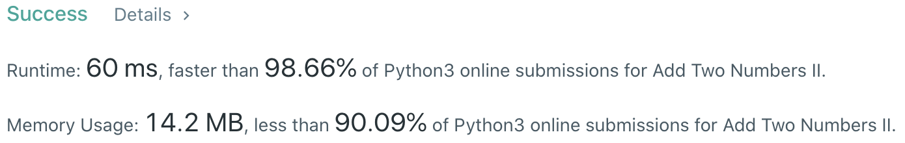

# Problem
[445. Add Two Numbers II](https://leetcode.com/problems/add-two-numbers-ii/)

# Performance



# Python
```Python
class Solution:
    def addTwoNumbers(self, l1: ListNode, l2: ListNode) -> ListNode:

        # ==================================================
        #  Linked List                        (Recursive)  =
        # ==================================================
        # time  : O(m+n)
        # space : O(abs(m-n))

        len1, len2 = self.length(l1), self.length(l2)
        if   len1 > len2: l2 = self.fill(l2, len1 - len2)
        elif len2 > len1: l1 = self.fill(l1, len2 - len1)

        carry, ret = self.merge(l1, l2)
        if carry: ret = ListNode(1, ret)
        
        return ret
        
    def length(self, l: ListNode) -> int:
        length, tmp = 0, l
        while tmp:
            length += 1
            tmp = tmp.next
        return length

    def fill(self, l: ListNode, num: int) -> ListNode:
        ret = head = ListNode(-1)
        for i in range(num):
            head.next = ListNode(0)
            head = head.next
        head.next = l
        return ret.next

    def merge(self, l1: ListNode, l2: ListNode) -> ListNode:
        """
        Recursive to merge two lists while summing nodes' values
        """
        if not l1 and not l2: return (0, None)
        carry, next = self.merge(l1.next, l2.next)
        curSum = l1.val + l2.val + carry
        node = ListNode(curSum % 10, next)
        return (curSum // 10, node)
```

```Python
class Solution:
    def addTwoNumbers(self, l1: ListNode, l2: ListNode) -> ListNode:
        
        # ==================================================
        #  Reverse Linked List                             =
        # ==================================================
        # time  : O(m+n)
        # space : O(1)

        l1, l2 = self.reverse(l1), self.reverse(l2)
        return self.reverse(self.add(l1, l2))

    def reverse(self, head: ListNode) -> ListNode:
        pre = None
        while head:
            tmp = head.next
            head.next = pre
            pre, head = head, tmp
        
        return pre
    
    def add(self, l1: ListNode, l2: ListNode) -> ListNode:
        ret = cur = ListNode(0)
        
        carry = 0
        while l1 or l2:
            if l1: n1, l1 = l1.val, l1.next
            else: n1 = 0
            if l2: n2, l2 = l2.val, l2.next
            else: n2 = 0
                
            total  = n1 + n2 + carry
            carry  = total // 10
            total %= 10
            
            cur.next = ListNode(total)
            cur = cur.next
            
        if carry: cur.next = ListNode(1)
        
        return ret.next
```

```Python
class Solution:
    def addTwoNumbers(self, l1: ListNode, l2: ListNode) -> ListNode:
        
        # ==================================================
        #  Linked List + Stack                             =
        # ==================================================
        # time  : O(m+n)
        # space : O(m+n)
    
        stack1, stack2 = [], []
        while l1:
            stack1.append(l1.val)
            l1 = l1.next
        while l2:
            stack2.append(l2.val)
            l2 = l2.next
            
        carry, ret = 0, None
        while stack1 or stack2 or carry:
            val1 = stack1.pop() if stack1 else 0
            val2 = stack2.pop() if stack2 else 0
            curSum = val1 + val2 + carry
            carry = curSum // 10
            curSum = curSum % 10
            
            ret = ListNode(curSum, ret)
        
        return ret
```

# Java
```Java
class Solution {
    /**
     * @time  : O(m+n)
     * @space : O(m+n)
     */
    
    public ListNode addTwoNumbers(ListNode l1, ListNode l2) {
        Stack<Integer> stack1 = new Stack<Integer>();
        Stack<Integer> stack2 = new Stack<Integer>();
        
        while(l1 != null) {
            stack1.push(l1.val);
            l1 = l1.next;
        };
        while(l2 != null) {
            stack2.push(l2.val);
            l2 = l2.next;
        }
        
        int carry = 0;
        ListNode ret = null;
        while (!stack1.empty() || !stack2.empty() || carry != 0) {
            int val1 = (!stack1.empty()) ? stack1.pop() : 0;
            int val2 = (!stack2.empty()) ? stack2.pop() : 0;
            int curSum = val1 + val2 + carry;
            carry = curSum / 10;
            curSum = curSum % 10;
            ret = new ListNode(curSum, ret);
        }
        
        return ret;
    }
}
```
