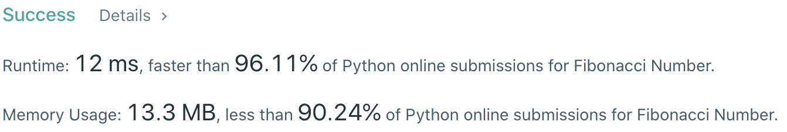
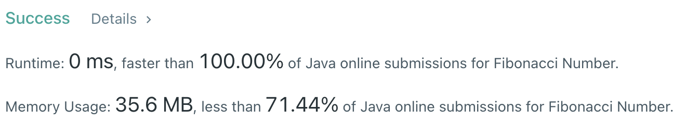

# Problem
[0509-fibonacci-number](https://leetcode.com/problems/fibonacci-number)

# Performance



# Python
```Python
class Solution:
    def fib(self, n: int) -> int:
        # (base case)
        if n == 0 or n == 1: return n
        
        # ==================================================
        #  Dynamic Programming                             =
        # ==================================================
        # time  : O(n)
        # space : O(1)

        n1, n2 = 0, 1
        for i in range(n - 1):
            n1, n2 = n2, n1 + n2
            
        return n2
```

# Java
```Java
class Solution {
    /**
     * @time  : O(n)
     * @space : O(1)
     */

    public int fib(int n) {
        /* base case */
        if(n == 0 || n == 1) return n;
        
        int first = 0, second = 1;
        
        for(int i=0 ; i<n-1 ; i++) {
            int tmp = first;
            first = second;
            second += tmp;
        }
        
        return second;
    }
}
```
