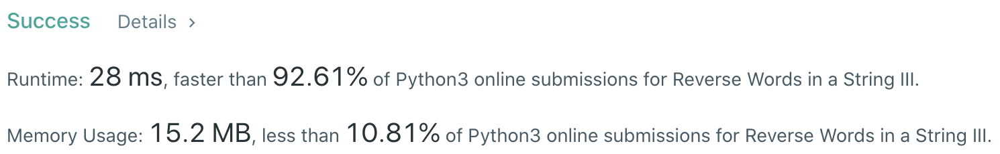
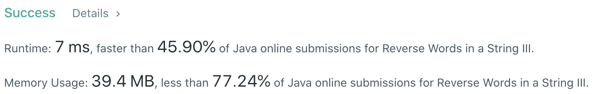

# Problem
[557. Reverse Words in a String III](https://leetcode.com/problems/reverse-words-in-a-string-iii/)

# Performance



# Python
```Python
class Solution:
    def reverseWords(self, s: str) -> str:
        
        # ==================================================
        #  String                                          =
        # ==================================================
        # time  : O(n), n is the length of s
        # space : O(n)
        
        l, r = 0, len(s) - 1
        word, ans = '', ''
        while l <= r:
            if s[l] == ' ':
                if word: ans += self.reverse(word) + ' '
                word = ''
                l += 1
                continue
                
            word += s[l]
            l += 1
        
        if word: ans += self.reverse(word) + ' '
            
        return ans[:-1]
            
    def reverse(self, s: str) -> str:
        s, l, r = [char for char in s], 0, len(s) - 1
        while l < r:
            s[l], s[r] = s[r], s[l]
            l += 1
            r -= 1
            
        ret = ''
        for char in s: ret += char
        return ret
```

```Python
class Solution:
    def reverseWords(self, s: str) -> str:
        return ' '.join(x[::-1] for x in s.split())
```

# Java
```Java
class Solution {
    /**
     * @time  : O(n)
     * @space : O(n)
     */
    
    public String reverseWords(String input) {
        StringBuilder result = new StringBuilder();
        StringBuilder word = new StringBuilder();
        
        for (int i = 0; i < input.length(); i++) {
            if (input.charAt(i) != ' ') {
                word.append(input.charAt(i));
            } else {
                result.append(word.reverse());
                result.append(" ");
                word.setLength(0);
            }
        }
        
        result.append(word.reverse());
        return result.toString();
    }
}
```