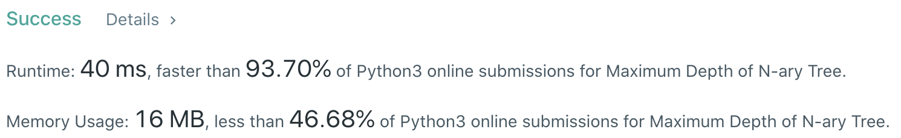

# Problem
[559. Maximum Depth of N-ary Tree](https://leetcode.com/problems/maximum-depth-of-n-ary-tree/)

# Performance


# Python
```python
class Solution:
    def maxDepth(self, root: 'Node') -> int:
        # (base case)
        if not root: return 0
        if not root.children: return 1
        
        # ==================================================
        #  N-ary Tree + Level Order Traversal              =
        # ==================================================
        # time  : O(n)
        # space : O(n)
        
        maxDepth = 0
        stack = [root]
        
        while stack:
            for i in range(len(stack)):
                node = stack.pop(0)
                
                for element in node.children:
                    stack.append(element)
            
            maxDepth += 1
            
        return maxDepth
```

# Java
```Java
class Solution {
    /**
     * @time  : O(n)
     * @space : O(n)
     */
    
    public int maxDepth(Node root) {
        /* base case */
        if(root == null) return 0;
        if(root.children == null) return 1;
        
        int maxDepth = 0;
        Queue<Node> queue = new LinkedList<>();
        queue.add(root);
        
        while(!queue.isEmpty()) {
            int size = queue.size();
            for(int i=0 ; i<size ; i++) {
                Node node = queue.remove();
                
                if(node.children != null) {
                    for(Node element: node.children) queue.add(element);
                }
            }
            
            maxDepth++;
        }
        
        return maxDepth;
    }
}
```