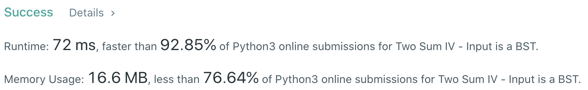
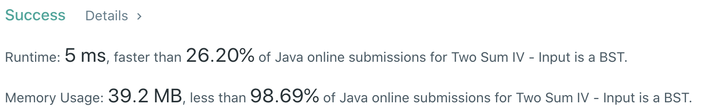

# Problem
[653. Two Sum IV - Input is a BST](https://leetcode.com/problems/two-sum-iv-input-is-a-bst/)

# Performance



# Python
```python
class Solution:
    def findTarget(self, root: TreeNode, k: int) -> bool:
        
        # ==================================================
        #  Binary Search Tree + Stack                      =
        # ==================================================
        # time  : O(n)
        # space : O(n)
        
        stack = [root]
        values = set()
        
        while stack:
            node = stack.pop()
            if k - node.val in values: return True
            values.add(node.val)
            
            if node.left: stack.append(node.left)
            if node.right: stack.append(node.right)
        
        return False
```

# Java
```Java
class Solution {
    /**  
     * @time  : O(n)
     * @space : O(n)
     */
    
    public boolean findTarget(TreeNode root, int k) {
        HashSet<Integer> values = new HashSet<>();
        Stack<TreeNode> stack = new Stack<>();
        stack.push(root);
        
        while(!stack.isEmpty()) {
            TreeNode node = stack.pop();
            if(values.contains(k - node.val)) return true;
            values.add(node.val);
            
            if(node.left != null) stack.push(node.left);
            if(node.right != null) stack.push(node.right);
        }
        
        return false;
    }
}
```