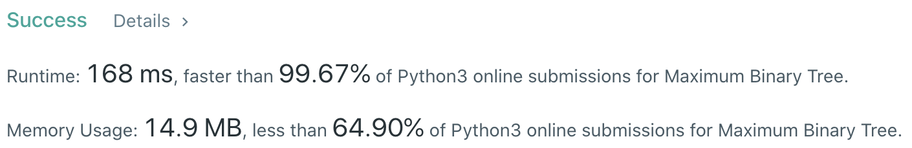

# Problem
[0654. Maximum Binary Tree](https://leetcode.com/problems/maximum-binary-tree/)

# Performance



# Python
```Python
class Solution:
    def constructMaximumBinaryTree(self, nums: List[int]) -> TreeNode:
        # (base case)
        if not nums: return None
        if len(nums) == 1: return TreeNode(nums[0])
        
        # ==================================================
        #  Binary Tree + Monotonic Stack                   =
        # ==================================================
        # time  : O(n)
        # space : O(n)
        
        """
        input: [3,2,1,6,0,5]
        
        stack: [3]          3.left  = None
        stack: [3,2]        2.left  = None, 3.right = 2
        stack: [3,2,1]      1.left  = None, 2.right = 1
        stack: [6]          6.left  = 3
        stack: [6,0]        0.left  = None, 6.right = 0
        stack: [6,5]        5.left  = 0,    6.right = 5
        """

        stack = []
        for num in nums:
            node, last = TreeNode(num), None
            
            # 1. (current node's value > previous node's value) pop from stack
            # 2. append the MAX element in the stack to current node's left
            while stack and stack[-1].val < num:
                last = stack.pop()
            node.left = last
            
            # (current node's value < previous node's value)
            # append current node to previous node's right
            if stack: stack[-1].right = node
            
            stack.append(node)
            
        return stack[0]
```

```Python
class Solution:
    def constructMaximumBinaryTree(self, nums: List[int]) -> TreeNode:
        # (base case)
        if not nums: return None
        if len(nums) == 1: return TreeNode(nums[0])
        
        # ==================================================
        #  Binary Tree + Recursion                         =
        # ==================================================
        # time  : O(n^2)
        # space : O(n)
        
        self.nums = nums
        return self.construct(0, len(nums))
        
    def construct(self, left: int, right: int) -> TreeNode:
        if left >= right: return None

        maxIndex = self.findMax(left, right)
        return TreeNode(self.nums[maxIndex],
                        self.construct(left, maxIndex), self.construct(maxIndex + 1, right))

    def findMax(self, left: int, right: int) -> int:
        maxIndex = left
        for i in range(left, right):
            if self.nums[i] > self.nums[maxIndex]:
                maxIndex = i

        return maxIndex
```

# Java
```Java
public class Solution {
    /**
     * @time  : O(n^2)
     * @space : O(n)
     */
    
    public TreeNode constructMaximumBinaryTree(int[] nums) {
        /* base case */
        if(nums.length == 0) return null;
        if(nums.length == 1) return new TreeNode(nums[0]);
        
        return construct(nums, 0, nums.length);
    }
    
    public TreeNode construct(int[] nums, int l, int r) {
        if (l >= r) return null;
        
        int max_i = max(nums, l, r);
        TreeNode root = new TreeNode(nums[max_i]);
        root.left = construct(nums, l, max_i);
        root.right = construct(nums, max_i + 1, r);
        return root;
    }
    
    public int max(int[] nums, int l, int r) {
        int max_i = l;
        for (int i = l; i < r; i++) {
            if (nums[max_i] < nums[i])
                max_i = i;
        }
        return max_i;
    }
}
```
