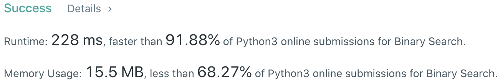
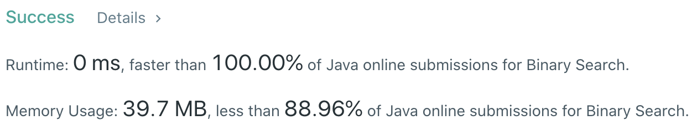

# Problem
[704. Binary Search](https://leetcode.com/problems/binary-search/)

# Performance



# Python
```Python
class Solution:
    def search(self, nums: List[int], target: int) -> int:
        # (base case)
        if len(nums) == 1: return 0 if nums[0] == target else -1
        
        # ==================================================
        #  Array + Binary Search                           =
        # ==================================================
        # time  : O(log(n))
        # space : O(1)

        l, r = 0, len(nums)
        while l < r:
            mid = (l + r) // 2
            
            if nums[mid] == target: return mid
            elif nums[mid] > target: r = mid
            elif nums[mid] < target: l = mid + 1
                
        return -1
```

# Java
```Java
class Solution {
    /**
     * @time  : O(log(n))
     * @space : O(1)
     */
    
    public int search(int[] nums, int target) {
        int left = 0, right = nums.length;
        
        while(left < right) {
            int mid = (left + right) / 2;
            
            if(nums[mid] == target) {
                return mid;
                
            } else if(nums[mid] > target) {
                right = mid;
                
            } else if(nums[mid] < target) {
                left = mid + 1;
            }
        }
        
        return -1;
    }
}
```