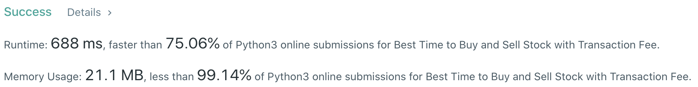
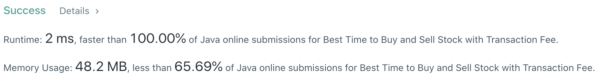

# Problem
[714. Best Time to Buy and Sell Stock with Transaction Fee](https://leetcode.com/problems/best-time-to-buy-and-sell-stock-with-transaction-fee/)

# Performance



# Python
```Python
class Solution:
    def maxProfit(self, prices: List[int], fee: int) -> int:
        # (base case)
        if len(prices) == 0 or len(prices) == 1: return 0

        # ==================================================
        #  Array + Dynamic Programming              (FSM)  =
        # ==================================================
        # time  : O(n)
        # space : O(1)
        
        hold, noHold = float('-inf'), 0
        
        for price in prices:
            preHold, preNoHold = hold, noHold
            
            hold   = max(preHold,   preNoHold - price)
            noHold = max(preNoHold, preHold   + price - fee)
            
        return noHold
```

# Java
```Java
class Solution {
    /**
     * @time  : O(n)
     * @space : O(1)
     */

    public int maxProfit(int[] prices, int fee) {
        /* base case */
        if(prices.length == 1) return 0;
        
        int hold = -prices[0], noHold = 0;
        
        for(int i=1 ; i<prices.length ; i++) {
            int preHold = hold, preNoHold = noHold;
            
            hold   = Math.max(preHold,   preNoHold - prices[i]);
            noHold = Math.max(preNoHold, preHold   + prices[i] - fee);
        }
        
        return noHold;
    }
}
```