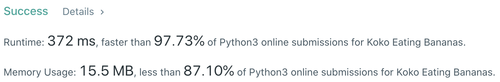
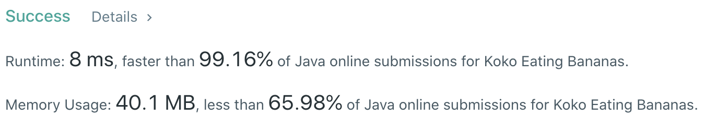

# Problem
[875. Koko Eating Bananas](https://leetcode.com/problems/koko-eating-bananas/)

# Performance



# Python
```Python
class Solution:
    def minEatingSpeed(self, piles: List[int], h: int) -> int:
        
        # ==================================================
        #  Binary Search                                   =
        # ==================================================
        # time  : O(nlog(m)), m is the search space
        # space : O(1)
        
        left, right = 1, max(piles)
        while left < right:
            speed = (left + right) // 2
            
            if sum(ceil(pile / speed) for pile in piles) <= h: right = speed
            else: left = speed + 1
        
        return left
```

# Java
```Java
class Solution {
    /**
     * @time  : O(nlog(m)), m is the search space
     * @space : O(1)
     */
    
    public int minEatingSpeed(int[] piles, int h) {
        int l = 1, r = 1000000000;
        while (l < r) {
            int m = (l + r) / 2, total = 0;
            for (int p : piles) total += (p - 1) / m + 1;
            
            if (total <= h) r = m;
            else l = m + 1;
        }
        return l;
    }
}
```