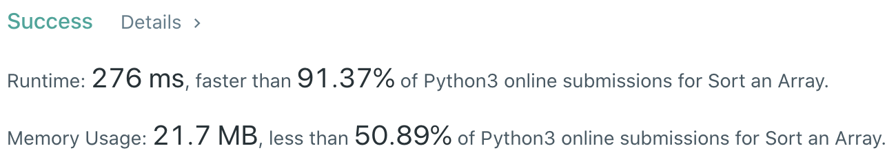
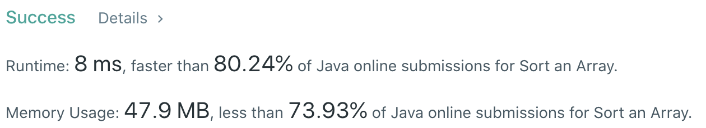

# Problem
[912. Sort an Array](https://leetcode.com/problems/sort-an-array/)

# Performance



# Python
```Python
class Solution:
    def sortArray(self, nums: List[int]) -> List[int]:
        # return self.quickSort(nums)
        # return self.quickSort1(nums)
        return self.mergeSort(nums)
        
    
    def mergeSort(self, nums: List[int]) -> List[int]:
        # ==================================================
        #  Array + Quick Sort                              =
        # ==================================================
        # time  : O(nlog(n))
        # space : O(n)
        
        def merge(left: List[int], right: List[int]) -> List[int]:
            ret, p1, p2 = [], 0, 0
            while p1 < len(left) and p2 < len(right):
                if left[p1] <= right[p2]:
                    ret += [left[p1]]
                    p1 += 1
                else:
                    ret += [right[p2]]
                    p2 += 1
            ret += left[p1:] or right[p2:]
            return ret
        
        if len(nums) == 1: return nums
        
        left, right = self.mergeSort(nums[:len(nums)//2]), self.mergeSort(nums[len(nums)//2:])
        return merge(left, right)
    
    def quickSort(self, nums: List[int]) -> List[int]:
        # ==================================================
        #  Array + Quick Sort                              =
        # ==================================================
        # time  : O(nlog(n))
        # space : O(nlog(n))
        
        def sort(nums: List[int], left: int, right: int) -> None:
            if right == left or right - left == 1: return
            
            pivot = partition(nums, left, right - 1)
            sort(nums, left, pivot)
            sort(nums, pivot + 1, right)
            
        def partition(nums: List[int], left: int, right: int) -> int:
            randomNum = (left + right) // 2
            pivot = right
            nums[randomNum], nums[pivot] = nums[pivot], nums[randomNum]
            placeP = left
            for i in range(left, right):
                if nums[i] < nums[pivot]:
                    nums[placeP], nums[i] = nums[i], nums[placeP]
                    placeP += 1
            nums[pivot], nums[placeP] = nums[placeP], nums[pivot]
            return placeP
        
        sort(nums, 0, len(nums))
        return nums
    
    def quickSort1(self, nums: List[int]) -> List[int]:
        # (base case)
        if not nums or len(nums) == 1: return nums
        
        # ==================================================
        #  Array + Quick Sort                              =
        # ==================================================
        # time  : O(nlog(n))
        # space : O(nlog(n))
        
        pivot = nums[len(nums) // 2]
        lt, eq, lg = list(), list(), list()
        for num in nums:
            if num == pivot: eq += [num]
            elif num > pivot: lg += [num]
            else: lt += [num]
                
        return self.quickSort(lt) + eq + self.quickSort(lg)
```

# Java
```Java
class Solution {
    public int[] sortArray(int[] nums) {
        return quickSort(nums);
        // return mergeSort(nums);
    }
    
    /**  
     * @time  : O(nlog(n))
     * @space : O(n)
     */
    public int[] mergeSort(int[] nums) {
        sortMerge(nums, 0, nums.length - 1);
        return nums;
    }
    
    private void sortMerge(int[] nums, int left, int right) {
        if(left < right) {
            int mid = (left + right) / 2;
            sortMerge(nums, left, mid);
            sortMerge(nums, mid + 1, right);
            merge(nums, left, mid, right);
        }
    }
    
    private void merge(int[] nums, int left, int mid, int right) {
        int[] ret = new int[right - left + 1];
        int p0 = 0, p1 = left, p2 = mid + 1;
        while(p1 <= mid && p2 <= right) {
            if(nums[p1] < nums[p2]) ret[p0++] = nums[p1++];
            else ret[p0++] = nums[p2++];
        }
        
        while(p1 <= mid) ret[p0++] = nums[p1++];
        while(p2 <= right) ret[p0++] = nums[p2++];
        
        for(int i=left ; i<=right ; i++) nums[i] = ret[i - left];
    }
    
    /**  
     * @time  : O(nlog(n))
     * @space : O(nlog(n))
     */
    public int[] quickSort(int[] nums) {
        sortQuick(nums, 0, nums.length);
        return nums;
    }
    
    private void sortQuick(int[] nums, int left, int right) {
        if(left == right || right - left == 1) return;
        
        int pivot = partition(nums, left, right - 1);
        sortQuick(nums, left, pivot);
        sortQuick(nums, pivot + 1, right);
    }
    
    private int partition(int[] nums, int left, int right) {
        int randomNum = (left + right) / 2;
        int pivot = right;
        
        int tmp = nums[randomNum];
        nums[randomNum] = nums[pivot];
        nums[pivot] = tmp;
        
        int placeP = left;
        for(int i=left ; i<right ; i++) {
            if(nums[i] <= nums[pivot]) {
                tmp = nums[placeP];
                nums[placeP] = nums[i];
                nums[i] = tmp;
                
                placeP++;
            }
        }
        
        tmp = nums[pivot];
        nums[pivot] = nums[placeP];
        nums[placeP] = tmp;
        
        return placeP;
    }
}
```