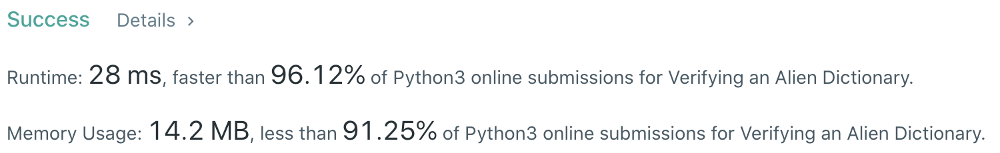
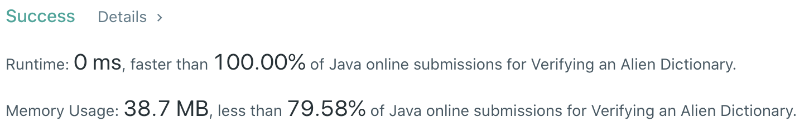

# Problem
[0953. Verifying an Alien Dictionary](https://leetcode.com/problems/verifying-an-alien-dictionary/)

# Performance



# Python
```Python
class Solution:
    def isAlienSorted(self, words: List[str], order: str) -> bool:
        
        # ==================================================
        #  String                                          =
        # ==================================================
        # time  : O(M), M is the total number of chars in words
        # space : O(1)
        
        table = dict()
        for i in range(len(order)): table[order[i]] =  i
            
        for i in range(len(words) - 1):
            for j in range(len(words[i])):
                # (current string's length > adjacent string's length)
                if j+1 > len(words[i+1]): return False
                
                if words[i][j] != words[i+1][j]:
                    if table[words[i][j]] > table[words[i+1][j]]: return False
                    break
                    
        return True
```

# Java
```Java
class Solution {
    /**
     * @time  : O(M), M is the total number of chars in words
     * @space : O(1)
     */
    
    public boolean isAlienSorted(String[] words, String order) {
        int[] orderMap = new int[26];
        for (int i=0; i<order.length(); i++) {
            orderMap[order.charAt(i) - 'a'] = i;
        }

        for (int i=0; i<words.length-1; i++) {
            for (int j=0; j<words[i].length(); j++) {
                /* 
                    If we do not find a mismatch letter between words[i] and words[i + 1],
                    we need to examine the case when words are like ("apple", "app").
                */
                if (j+1 > words[i+1].length()) return false;

                if (words[i].charAt(j) != words[i+1].charAt(j)) {
                    int currentWordChar = words[i].charAt(j) - 'a';
                    int nextWordChar = words[i+1].charAt(j) - 'a';
                    
                    if (orderMap[currentWordChar] > orderMap[nextWordChar]) return false;
                    
                    /* 
                        If we find the first different letter and they are sorted,
                        then there's no need to check remaining letters
                    */
                    else break;
                }
            }
        }

        return true;
    }
}
```