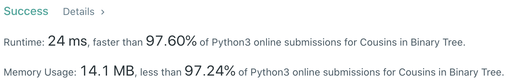

# Problem
[993. Cousins in Binary Tree](https://leetcode.com/problems/cousins-in-binary-tree/)

# Performance


# Python
```python
class Solution:
    def isCousins(self, root: TreeNode, x: int, y: int) -> bool:
        
        # ==================================================
        #  Binary Tree + Level Order Traversal             =
        # ==================================================
        # time  : O(n)
        # space : O(n)
        
        depth = 0
        target = None
        stack = [(root, None)]
        
        while stack:
            for i in range(len(stack)):
                node, parent = stack.pop(0)
                
                if node.val == x or node.val == y:
                    if target:
                        return True if depth == target[0] and parent != target[1] else False
                    target = (depth, parent)
            
                if node.left: stack.append((node.left, node))
                if node.right: stack.append((node.right, node))
            
            if target: return False
            depth += 1
            
        return False
```