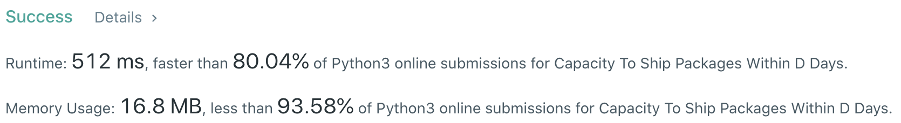
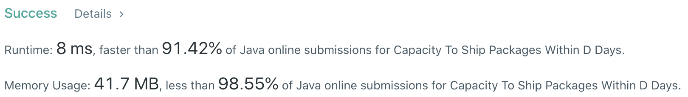

# Problem
[1011. Capacity To Ship Packages Within D Days](https://leetcode.com/problems/capacity-to-ship-packages-within-d-days/)

# Performance



# Python
```Python
class Solution:
    def shipWithinDays(self, weights: List[int], days: int) -> int:
        # (base case)
        if len(weights) == 1: return 1
        
        # ==================================================
        #  Binary Search                                   =
        # ==================================================
        # time  : O(nlog(m)), m is the search space
        # space : O(1)
        
        maxWeight, total = 0, 0
        for w in weights:
            total += w
            maxWeight = max(maxWeight, w)
        
        l, r = maxWeight, total
        while l < r:
            capacity = (l + r) // 2
            if self.valid(weights, days, capacity): r = capacity
            else: l = capacity + 1
            
        return l
    
    def valid(self, weights: List[int], D: int, capacity: int) -> bool:
        days, total = 1, 0
        for w in weights:
            total += w
            if total > capacity:
                total = w
                days += 1
                
                if days > D: return False
                
        return True
```

# Java
```Java
class Solution {
    /**
     * @time  : O(nlog(m)), m is the search space
     * @space : O(1)
     */
    
    public int shipWithinDays(int[] weights, int days) {
        /* base case */
        if(weights.length == 1) return 1;
        
        int left = 0, right = 0;
        for (int w: weights) {
            left = Math.max(left, w);
            right += w;
        }
        
        while(left < right) {
            int capacity = (left + right) / 2;
                
            int tmpDays = 1, tmpWeight = 0;
            for(int w: weights) {
                tmpWeight += w;
                if(tmpWeight > capacity) {
                    tmpWeight = w;
                    tmpDays += 1;
                    
                    if(tmpDays > days) break;
                }
            }
            
            if(tmpDays <= days) right = capacity;
            else left = capacity + 1;
        }
        
        return left;
    }
}
```