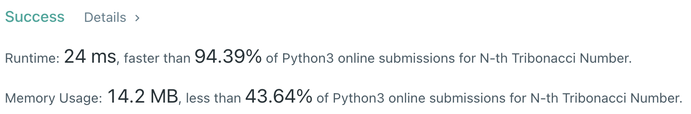
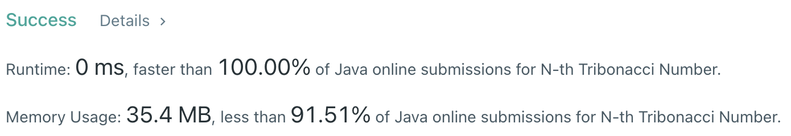

# Problem
[1137. N-th Tribonacci Number](https://leetcode.com/problems/n-th-tribonacci-number/)

# Performance



# Python
```Python
class Solution:
    def tribonacci(self, n: int) -> int:
        # (base case)
        if n == 0: return 0
        if n == 1: return 1
        if n == 2: return 1
        
        # ==================================================
        #  Dynamic Programming                             =
        # ==================================================
        # time  : O(n)
        # space : O(1)
        
        first, second, third = 0, 1, 1
        
        for i in range(n - 2):
            ans = first + second + third
            first = second
            second = third
            third = ans
            
        return third
```

# Java
```Java
class Solution {
    /**
     * @time  : O(n)
     * @space : O(1)
     */

    public int tribonacci(int n) {
        /* base case */
        if(n == 0) return 0;
        if(n == 1 || n == 2) return 1;
        
        int first = 0, second = 1, third = 1;
        
        for(int i=0 ; i<n-2 ; i++) {
            int ans = first + second + third;
            first = second;
            second = third;
            third = ans;
        }
        
        return third; 
    }
}
```