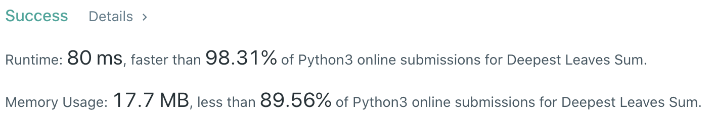
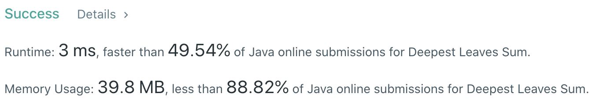

# Problem
[1302. Deepest Leaves Sum](https://leetcode.com/problems/deepest-leaves-sum/)

# Performance



# Python
```python
class Solution:
    def deepestLeavesSum(self, root: TreeNode) -> int:
        # (base case)
        if not root.left and not root.right: return root.val
        
        # ==================================================
        #  Binary Tree + Level Order Traversal             =
        # ==================================================
        # time  : O(n)
        # space : O(n)
        
        ans = 0
        stack = [root]
        
        while stack:
            ans = 0
            
            # loop through stack for current length, pop the first node
            for i in range(len(stack)):
                node = stack.pop(0)
                ans += node.val
                
                if node.left: stack.append(node.left)
                if node.right: stack.append(node.right)
                    
        return ans
```

# Java
```Java
class Solution {
    /**  
     * @time  : O(n)
     * @space : O(n)
     */
    
    public int deepestLeavesSum(TreeNode root) {
        /* base case */
        if(root.left == null && root.right == null) return root.val;
        
        Queue<TreeNode> stack = new LinkedList<TreeNode>();
        stack.add(root);
        int ans = 0;
        
        while(!stack.isEmpty()) {
            ans = 0;
            
            int size = stack.size();
            for(int i=0 ; i<size ; i++) {
                TreeNode node = stack.remove();
                ans += node.val;
                
                if(node.left != null) stack.add(node.left);
                if(node.right != null) stack.add(node.right);
            }
        }
        
        return ans;
    }
}
```